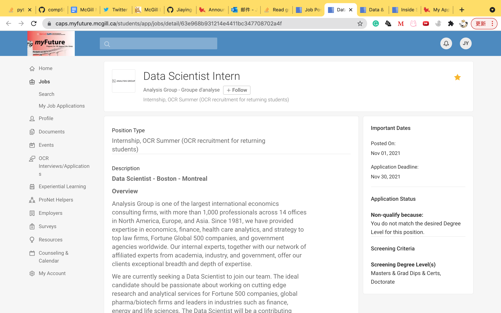
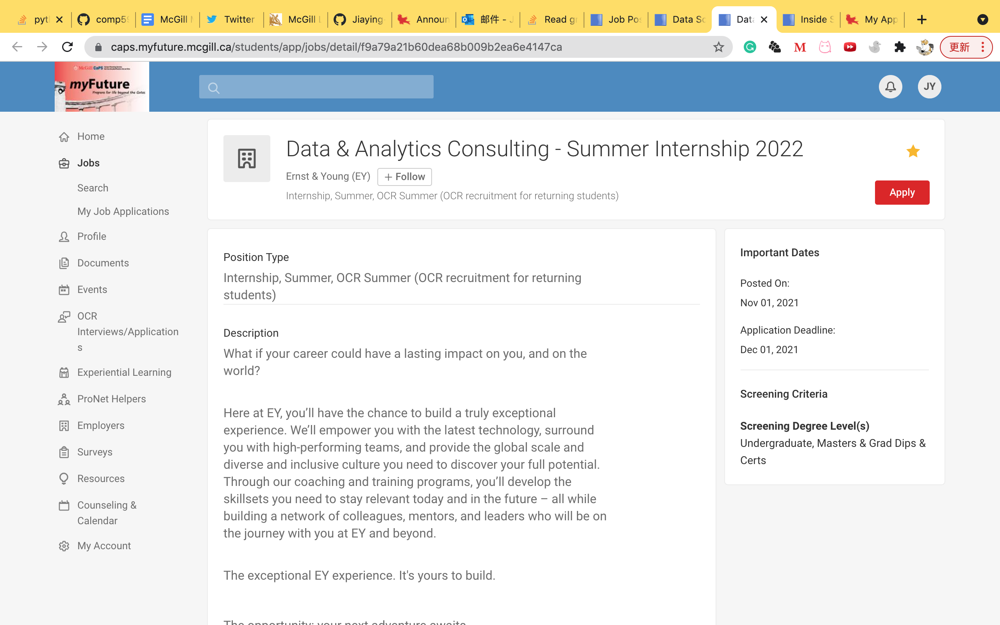
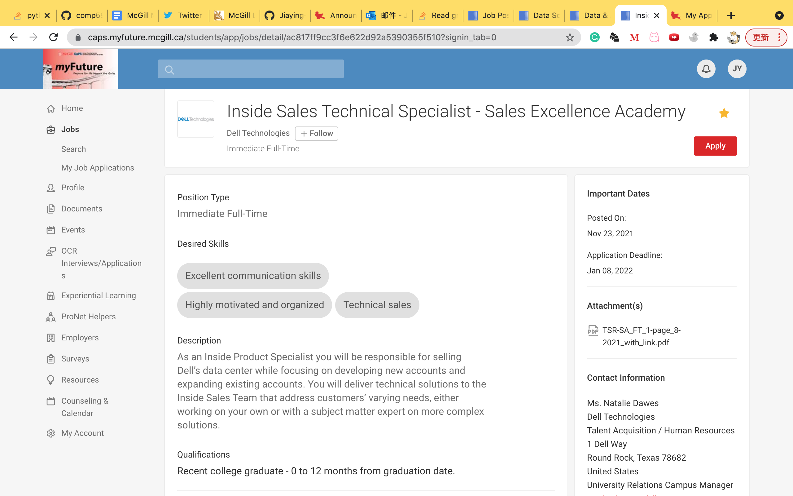

# Task 1: Data Science Careers
## Reason of Interest:  
I've never done intensive data science or analytics job before, I hope to actually apply my knowledge by doing technical duties and untangling cutting edge problems.  
The jobs I chose involves NLP, machine learning, database, and even data center, which I believe will put me in a frontier in data industry.  
I believe that one day I will get the chance to showcase what I've gained from Comp598 and my master degree.  

## Job descriptions:

### Position One: Data Scientist Intern
1.	Company: Analysis Group
2.	Link: https://caps.myfuture.mcgill.ca/students/app/jobs/detail/63e968b931214e4411bc347708702a4f  
3.	Job Descriptions:  
*	Developing data engineering and machine learning production systems for full stack data science projects  
*	Using natural language processing methodologies to work with EMR data, social media data and other unstructured data  
*	Optimizing procedures for managing and accessing large databases (e.g., insurance claims, electronic health records, financial transactions)  
*	Developing and reviewing software and packages in R, Python, C# and other Object Oriented Languages  

### Position Two: Data And Analytics Consulting Summer Internship
1.	Company: E&Y
2.	Link: https://caps.myfuture.mcgill.ca/students/app/jobs/detail/f9a79a21b60dea68b009b2ea6e4147ca
3.	Job Description:
We are seeking passionate, entrepreneurial individuals to join us on an exciting journey of building the best performing professional services practice in Data, Analytics, & AI.   
You will help our clients navigate the complex world of data.   
We’ll look to you to provide our clients with a unique business perspective on how Data, Analytics, & AI can transform and improve their entire organization - starting with key business issues they face.   
This is a high growth, high visibility area with plenty of opportunities to enhance your skillset and build your career.  
As we are client facing, we expect our staff to demonstrate professionalism and competence in the client's environment.  
To maintain a strong client focus, be responsive to client requests, and to develop/maintain productive working relationships with client personnel. Staff should be informed of current business/economic developments relevant to the client's business and collaborate with team members to set goals and responsibilities for the project.   
4.	Qualifications:
*	Pursuing an undergraduate or graduate degree in business, STEM, or another related major  
*	Demonstrated project management, teaming, organizational, analytical and problem-solving skill and the willingness and ability to learn and work independently with minimal supervision  
*	Effective organization and time management skills with the ability to work under pressure and adhere to project deadlines  
*	Strong interpersonal, written and verbal communication skills  
*	Committed to integrity within a professional environment  

### Position Three: Inside Sales Technical Specialist
1.	Company: Dell Technologies
2.	Link: https://caps.myfuture.mcgill.ca/students/app/jobs/detail/ac817ff9cc3f6e622d92a5390355f510?signin_tab=0
3.	Job Description: 
As an Inside Product Specialist you will be responsible for selling Dell’s data center while focusing on developing new accounts and expanding existing accounts. You will deliver technical solutions to the Inside Sales Team that address customers’ varying needs, either working on your own or with a subject matter expert on more complex solutions.    

# Task 2: Highs and Lows
### 1. What are the highlights of this class for you:  
Maybe this sounds vague, but it is true that I felt really fulfilled when I saw something I learnt from the my internship or research appearing in the course content. This indicates that I actually learned something by heart, and the course is making me more employable! I am really glad to see those contents in more details in this course. I'll list them here maybe:  
Jupyter notebooks, SQL and database, visualization, shiny(only mentioned), survival analysis 

### 2. What could have been done better:
1.	I found that we touched base on text data and numerical data, but never on image data. I hope that in the future, Prof. Ruths could cover something about how image data can be stored modified(rotation or reflection)and interpreted using Python.  
2.	I really think that data visualization is an important component in the data analysis process, so I am glad to learn about Bokeh in this course. I am wondering if it is possible for Prof. Ruths to discuss more on different plots and their application scenarios (what's the difference between pie charts and stacked bar charts, etc).  
3.	It is hard to explain everything in a single instruction file, so I suggest sticking one thread to the top for clarification.
4)	I believe that quite a lot of us would like to hear about the latest hot topic in data science! Or maybe we can have a guest speaker or Prof. Ruths sharing anecdotes in workplace :)

### 3. How did this course impact your future:
I would like to thank Prof. Ruths and all the TAs for sharing handy techniques about data science. I am applying to the graduate school and had no clue what will happen there. But this course let me know about network analysis for the first time. I believe this will definitely be beneficial to my future career, which is ameliorating urban digitalization. I have included this in not only my statement of purpose, but also my actual future plan ;)  